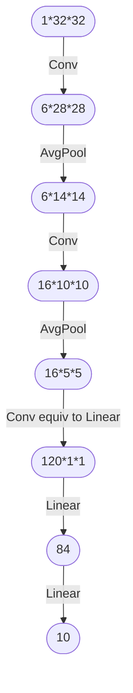

# Gradient-Based Learning Applied to Document Recognition

One of the first article that demonstrates the power of [[Convolutional network|convolutional neural network]].

It used the [[MNIST]] dataset. The architecture is straight forward, it's a succession of [[ConvolutionLayer|convolution layer]] and  [[AvgPooling|average pooling]] followed by a plain network of [[LinearLayer|linear layer]] each of this layers ([[ConvolutionLayer|convolution layer]] and [[LinearLayer|linear layer]]) are followed by an [[Sigmoid|sigmoid activation]] in the convolutional part of the network and [[Tanh|hyperbolic tangent]] in the plain network.

## Network

![[lenet5.png]]

### Network parameters

https://axon.cs.byu.edu/~martinez/classes/678/Papers/Convolution_nets.pdf